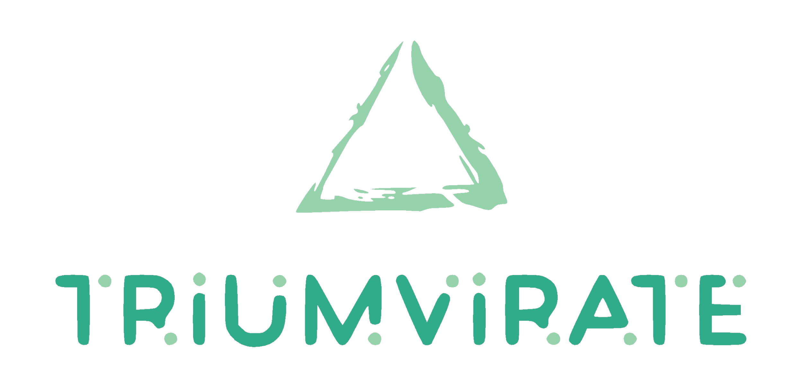

<p align="center">

</p>

# Three-Point Clustering Measurements in LSS

[](https://github.com/MikeSWang/Triumvirate/actions/workflows/ci.yml)
[](https://readthedocs.org/projects/triumvirate/builds/)
[](https://github.com/MikeSWang/Triumvirate/releases/latest)

``Triumvirate`` is a Python/C++ software package for measuring three-point (and
two-point) clustering statistics in large-scale structure (LSS) cosmological
analyses.


## Documentation

[](https://triumvirate.readthedocs.io/en/latest/)

Comprehensive documentation including the [scientific background](
https://triumvirate.readthedocs.io/en/latest/background.html),
[installation instructions](
https://triumvirate.readthedocs.io/en/latest/installation.html),
[tutorials](https://triumvirate.readthedocs.io/en/latest/tutorials.html) and
[API reference](https://triumvirate.readthedocs.io/en/latest/apiref.html)
can be found at [triumvirate.readthedocs.io](
https://triumvirate.readthedocs.io/en/latest/).


## Installation

### Python package

[](https://pypi.org/project/Triumvirate)
[](https://anaconda.org/msw/triumvirate)

``Triumvirate`` as a Python package is distributed through [PyPI](
https://pypi.org/project/Triumvirate) and [Conda](
https://anaconda.org/msw/triumvirate). Instructions for installation
can be found on the [Installation](
https://triumvirate.readthedocs.io/en/latest/installation.html#python-package)
page in the documentation.

### C++ library & program

``Triumvirate`` as either a static library or a binary executable can be
built using `make`. Instructions for compilation can be found on the
[Installation](
https://triumvirate.readthedocs.io/en/latest/installation.html#c-library-program)
page in the documentation.

### Development mode

Both the Python package and the C++ library/program can be set up in
development mode with `make`, provided that dependency requirements are
satisfied (GSL and FFTW3 libraries are mandatory while an OpenMP library
is optional).

First `git clone` the desired branch/release from the GitHub repository and
change into the repository directory path:

```console
$ git clone git@github.com:MikeSWang/Triumvirate.git --branch <branch-or-release>
$ cd Triumvirate
```

Then, execute in shell:

```console
$ make clean
$ make ([py|cpp]install)|(cpp[libinstall|appbuild]) [useomp=(true|1)]
```

where ``cpplibinstall`` or ``cppappbuild`` respectively builds the C++
static library or binary executable only, ``cppinstall`` builds both,
``pyinstall`` builds the Python package only, and ``install`` builds
all of the above. To enable OpenMP parallelisation, append ``useomp=true``
or ``useomp=1`` to the end of the second line as shown above.

> [!NOTE]
> The latest release is on the [``main``](
> https://github.com/MikeSWang/Triumvirate/tree/main) branch. The default
> [``Makefile``](Makefile) (located at the repository directory root) should
> work in most build environments, but may need to be modified as appropriate.

> [!NOTE]
> See the [Installation](
> https://triumvirate.readthedocs.io/en/latest/installation.html#dependencies)
> page in the documentation for more details about dependency requirements.

> [!IMPORTANT]
> If enabling OpenMP, ensure the C++ compiler used supports it and is
> configured accordingly. The default [``Makefile``](Makefile) (located at the
> repository directory root) assumes the GCC compiler and OpenMP library. See
> the [Installation](
> https://triumvirate.readthedocs.io/en/latest/installation.html#openmp-support)
> page in the documentation for more details.

> [!NOTE]
> Pass option ``-j[N] -O`` to `make` to run multiple concurrent jobs
> for parallel building (optional parameter ``N`` is the number of
> parallel jobs; see [GNU Make Manual](
> https://www.gnu.org/software/make/manual/html_node/Options-Summary.html)).


## Attribution

[](https://doi.org/10.21105/joss.05571)
[](https://doi.org/10.5281/zenodo.10072128)
[](https://arxiv.org/abs/2304.03643)
[](https://doi.org/10.1093/mnras/sty3249)
[](https://doi.org/10.1093/mnras/stx2333)

To acknowledge the use of ``Triumvirate`` in your published research, please
cite the publications linked above; for convenience, you can refer to the
files [``CITATION.cff``](CITATION.cff) and [``CITATION.md``](CITATION.md)
for the relevant information in different formats.


## Acknowledgement


This project has received funding from the European Research Council (ERC)
under the European Union's Horizon 2020 research and innovation programme
(Grant agreement ID: [853291](https://doi.org/10.3030/853291)).

Key underlying numerical algorithms were originally developed by
Naonori S Sugiyama, and are available in the GitHub repository [``hitomi``](
https://github.com/naonori/hitomi).

We thank the JOSS reviewers, William Coulton
([&commat;wcoulton](https://github.com/wcoulton)) and Alfonso Veropalumbo
([&commat;alfonso-veropalumbo](https://github.com/alfonso-veropalumbo)), for
their valuable feedback and suggestions (openjournals/joss-reviews#5571),
which have improved the functionality and documentation of the code.


## Contributing/Development


[](https://github.com/MikeSWang/Triumvirate/releases/latest)


[](https://github.com/MikeSWang/Triumvirate/issues?q=is%3Aopen+is%3Aissue+label%3Abuild)
[](https://github.com/MikeSWang/Triumvirate/issues?q=is%3Aopen+is%3Aissue+label%3Abug)
[](https://github.com/MikeSWang/Triumvirate/issues?q=is%3Aopen+is%3Aissue+label%3Afeature)
[](https://github.com/MikeSWang/Triumvirate/pulls)

[](https://codespaces.new/MikeSWang/Triumvirate?hide_repo_select=true&ref=main)

User feedback and contributions are very welcome. Please refer to the
[contribution guidelines](.github/CONTRIBUTING.md).


## Discussions & Wiki

[](https://github.com/MikeSWang/Triumvirate/discussions)

A [community forum](https://github.com/MikeSWang/Triumvirate/discussions)
for users and developers exists, where you can receive
announcements, post questions, share ideas and get updates.

A [wiki site](https://github.com/MikeSWang/Triumvirate/wiki) collects wisdoms
for specific use cases and user environments.


## Releases

Release notes are included in the [change log](CHANGELOG.md).


## Licence

[](https://github.com/MikeSWang/Triumvirate/blob/main/LICENCE)

``Triumvirate`` is made freely available under the [GPL-3.0 licence](
https://www.gnu.org/licenses/gpl-3.0.en.html) (or any later version).
Please see [``LICENCE``](LICENCE) (located at the repository directory root)
for full terms and conditions.

&copy; 2023 Mike S Wang & Naonori S Sugiyama
